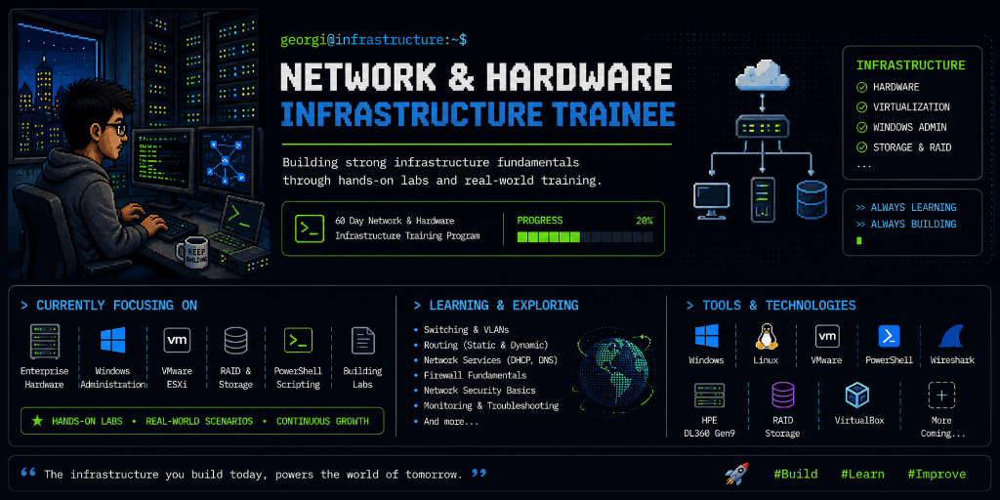

<!-- ╔══════════════════════════════════════════════════════════╗ -->
<!-- ║            GEORGIN SHAJU — GitHub Profile README         ║ -->
<!-- ╚══════════════════════════════════════════════════════════╝ -->

<!-- ┌─ BANNER ──────────────────────────────────────────────────┐ -->
<div align="center">
  
</div>
<!-- └───────────────────────────────────────────────────────────┘ -->


<!-- ┌─ BADGES ──────────────────────────────────────────────────┐ -->
<div align="center">
  <a href="https://github.com/FTGEORGII">
    
  </a>
  &nbsp;
  
  &nbsp;
  <a href="https://github.com/Ftgeorgii/Network-Infrastructure-Portfolio">
    
  </a>
</div>
<!-- └───────────────────────────────────────────────────────────┘ -->

<br/>


<br/>

<!-- ┌─ ABOUT ME ────────────────────────────────────────────────┐ -->
##  &nbsp;**About Me**

<div align="center">
  
</div>

<br/>

```yaml
🏷️ Name:     Georgin Shaju
🌐 Username: Ftgeorgii
📍 Location: Trichy, Tamil Nadu, India 🇮🇳
🎯 Focus:    Network Infrastructure & IT Operations

🔭 Currently:
  → Deployed VMware ESXi 8.0 on HPE ProLiant DL360 Gen9
  → Configured Active Directory, DNS, DHCP & Group Policy
  → Troubleshooting using OSI model methodology
  → Vatanix Technologies — 60-day hands-on program

🌱 Next:
  → Cisco networking labs — VLANs, OSPF, ACLs
  → Network monitoring with Zabbix
  → SOC Analyst fundamentals

⚡ Fun Fact: Once plugged a cable into the iLO port instead
   of the NIC — learned that Layer 1 starts with reading
   the port labels!
```

<br/>
<!-- └───────────────────────────────────────────────────────────┘ -->


<br/>

<!-- ┌─ TECH STACK ──────────────────────────────────────────────┐ -->
## 🛠️ **Tech Stack**

<div align="center">

### 🖥️ Systems & Virtualization
<p>
  
  
  
  
</p>

### 🌐 Networking & Infrastructure
<p>
  
  
  
  
</p>

### 🏢 Hardware & Tools
<p>
  
  
  
  
</p>

### 🔭 Learning Next
<p>
  
  
  
</p>

</div>
<!-- └───────────────────────────────────────────────────────────┘ -->

<br/>


<br/>

<!-- ┌─ GITHUB ANALYTICS ────────────────────────────────────────┐ -->
## 📊 **GitHub Analytics**

<div align="center">
  
  
</div>

<div align="center">
  
</div>
<!-- └───────────────────────────────────────────────────────────┘ -->

<br/>


<br/>

<!-- ┌─ CONNECT ─────────────────────────────────────────────────┐ -->
## 🤝 **Let's Connect**

<div align="center">

<a href="https://www.linkedin.com/in/georginshaju">
  
</a>

<br/><br/>

💬 *Building infrastructure from the ground up — always open to connect with fellow IT enthusiasts!*

</div>
<!-- └───────────────────────────────────────────────────────────┘ -->

<br/>

<!-- ┌─ FOOTER ──────────────────────────────────────────────────┐ -->
<div align="center">
  
</div>

<div align="center">
  <sub>✨ Crafted by <a href="https://github.com/FTGEORGII">Georgin Shaju</a> | Network &amp; Hardware Infrastructure Trainee ✨</sub>
</div>
<!-- └───────────────────────────────────────────────────────────┘ -->
