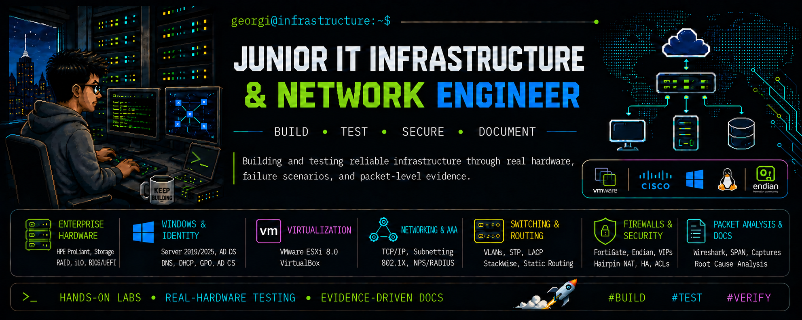

<!-- ╔══════════════════════════════════════════════════════════╗ -->
<!-- ║            GEORGIN SHAJU — GitHub Profile README         ║ -->
<!-- ╚══════════════════════════════════════════════════════════╝ -->

<!-- ┌─ BANNER ──────────────────────────────────────────────────┐ -->

  

<!-- └───────────────────────────────────────────────────────────┘ -->

<!-- ┌─ BADGES ──────────────────────────────────────────────────┐ -->

  
  &nbsp;
  
  &nbsp;
  

<!-- └───────────────────────────────────────────────────────────┘ -->

 

<!-- ┌─ HUB LINK ────────────────────────────────────────────────┐ -->

### 🔗 Find everything in one place

**[georgin-shaju.github.io](https://georgin-shaju.github.io)** — project highlights, GitHub, LinkedIn, and contact links.

<!-- └───────────────────────────────────────────────────────────┘ -->

 

  

<!-- ┌─ ABOUT ME ────────────────────────────────────────────────┐ -->
##  &nbsp;**About Me**

<pre>
🏷️ Name:     Georgin Shaju
🌐 Username: georgin-shaju
📍 Location: Trichy, Tamil Nadu, India
🎯 Focus:    Junior IT Infrastructure &
             Network Engineering

🔭 Current Infrastructure Work:
  → Windows Server 2019/2025 — AD DS,
    DNS, DHCP failover, AD CS and GPO
  → NPS/RADIUS for switch SSH and
    WPA2-Enterprise using PEAP + EAP-TLS
  → Cisco 1921, 3560-CX and 3850
    StackWise on real hardware
  → LACP EtherChannel, SPAN, VLANs,
    routing, ACLs and failover testing
  → FortiGate 300D — firewall policy,
    VIPs, Hairpin NAT and Active-Passive HA
  → Wireshark validation across both
    sides of routed and translated flows
  → NOC-style documentation built around
    baselines, faults, fixes and evidence
  → Vatanix Technologies — 60-day program
    complete, continuing through a 45-day
    advanced training phase

⚡ Fun Fact: Once plugged a cable into the
   iLO port instead of the NIC — learned
   that Layer 1 starts with reading the
   port labels!
</pre>

<!-- └───────────────────────────────────────────────────────────┘ -->

<!-- ┌─ FEATURED PROJECTS ───────────────────────────────────────┐ -->
## 🚀 **Featured Infrastructure Projects**

| Project | What the evidence demonstrates |
|---|---|
| **[FortiGate Hairpin NAT with Windows IIS](https://github.com/georgin-shaju/Network-Infrastructure-Portfolio/tree/main/HairpinNAT)** | An internal client reaches an IIS server through its external VIP; policy counters and matching endpoint captures prove DNAT and SNAT. |
| **[FortiGate Active-Passive HA](https://github.com/georgin-shaju/Network-Infrastructure-Portfolio/tree/main/FortiGate_Active-Passive-HA-Failover)** | A two-unit FortiGate 300D cluster is tested against WAN-link loss, full-power failure, failback, config sync, and disabled session pickup. |
| **[AD Infrastructure Failover & AAA](https://github.com/georgin-shaju/Network-Infrastructure-Portfolio/tree/main/AD_Infrastructure_Failover_and_AAA_Lab)** | Two Windows Server 2025 DCs provide AD/DNS/DHCP redundancy, AD CS, and NPS/RADIUS for SSH and WPA2-Enterprise authentication. |
| **[Cisco 3850 StackWise Lab](https://github.com/georgin-shaju/Network-Infrastructure-Portfolio/tree/main/Cisco_3850_StackWise_Lab)** | A real StackWise pair acts as the L3 gateway with dual LACP EtherChannels, SPAN monitoring, and four live resiliency tests. |

  

<!-- └───────────────────────────────────────────────────────────┘ -->

 

 

<!-- ┌─ TECH STACK ──────────────────────────────────────────────┐ -->
## 🛠️ **Tech Stack**

### 🖥️ Systems, Identity & Virtualization

  
  
  
  
  
  

### 🌐 Networking & Infrastructure

  
  
  
  
  

### 🔥 Firewalls, NAT & High Availability

  
  
  
  
  
  

### 🏢 Hardware & Tools

  
  
  
  
  

<!-- └───────────────────────────────────────────────────────────┘ -->

 

 

<!-- ┌─ GITHUB ANALYTICS ────────────────────────────────────────┐ -->
## 📊 **GitHub Activity**

  

<!-- └───────────────────────────────────────────────────────────┘ -->

 

 

<!-- ┌─ CONNECT ─────────────────────────────────────────────────┐ -->
## 🤝 **Let's Connect**

&nbsp;

&nbsp;

  

💬 *Building infrastructure from the ground up, testing the failure paths, and documenting what the evidence actually proves.*

<!-- └───────────────────────────────────────────────────────────┘ -->

 

<!-- ┌─ FOOTER ──────────────────────────────────────────────────┐ -->

  

  ✨ Georgin Shaju | Junior IT Infrastructure &amp; Network Engineer ✨

<!-- └───────────────────────────────────────────────────────────┘ -->
